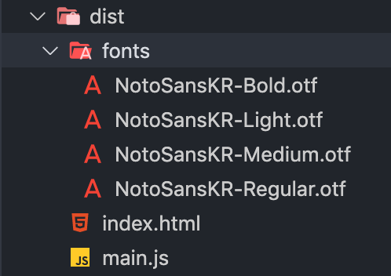
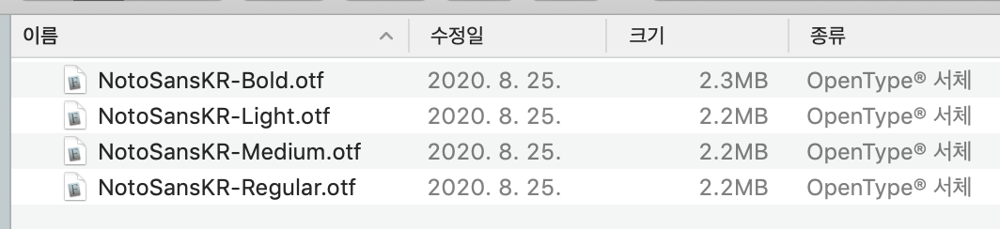
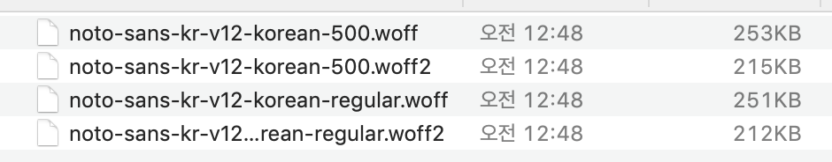
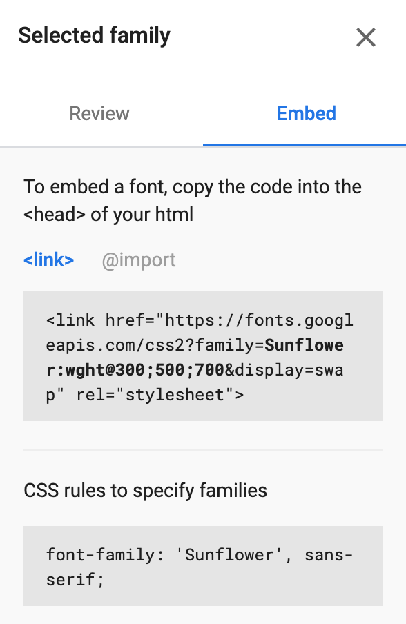

# 고쳐가는 기록 🤖

`201008~201009` 

## 웹 폰트 최적화

웹에서 개발자가 별도의 폰트를 지정하지 않으면 브라우저 별로 기본으로 설정된 폰트가 출력된다. 그렇다면 웹에서 사용자에게 원하는 폰트를 보여주기 위해서는 어떡해야 할까?

`font-family` 를 사용하여 원하는 폰트를 설정해주면 된다. 그런데, 만약 유저에게 해당 폰트가 없다면? 유저가 해당 폰트를 로컬에 가지고 있든, 아니든 동일한 폰트를 보여주기 위해 우리는 웹 폰트를 사용한다.

[출처 - https://shylog.com/googlefonts-and-webfont-optimization/]

폰트는 꽤나 비용이 비싼 자원이다. 웹 폰트를 최적화하는 방법에 대해 알아보자.

### 1. 폰트 용량 최적화

원래 폰트와 관련된 나의 웹팩 설정은 아래와 같았다. file-loader을 통해 4개의 otf 폰트를 번들링했다.

```js
module.exports = {
    // (...생략)
    module: {
        rules: [
          	// (...로더 생략)
            {
                test: /\.(woff(2)?|otf|ttf|eot|svg)(\?v=\d+\.\d+\.\d+)?$/,
                use: [
                    {
                        loader: "file-loader",
                        options: {
                            name: "[name].[ext]",
                            outputPath: "fonts/",
                        },
                    },
                ],
            },
        ],
    },
```

파일 로더를 통해 번들된 파일은 설정한 outputPath 디렉토리에 이렇게 정직하게 담기게 된다.



그런데 너무 정직한 나머지, 폰트 다운로드 시간이 엄청 오래 걸린다. performance(Fast 3G 설정)를 측정해보면 폰트 파일들이 세월아 네월아 다운로드 받아지고 있는 것을 볼 수 있다. Fast 3G임을 감안해도 Load 시간이 무려 24초.


#### 문제점: 폰트 파일의 용량

애초에 폰트 파일의 용량을 다 합하면 10메가 정도 된다. 다운로드 시간이 오래 걸릴 수 밖에 없는 것.



##### 폰트의 형식

폰트의 형식은 다양하고, 형식마다 용량은 물론 지원하는 브라우저도 다르다. 폰트 형식 별 브라우저 지원 현황은 [w3schools-CSS Web Fonts](https://www.w3schools.com/Css/css3_fonts.asp) 에서 확인할 수 있다. 용량 크기는 WOFF2 < WOFF < EOT < TTF 순이다. 

- WOFF2: 폰트에 최적화된 압축 및 처리 알고리즘을 사용하여 압축률이 가장 높다. 가장 경제적이다. 모든 모던 브라우저(크롬, 파이어폭스, 사파리, 오페라)에서 지원한다.
- WOFF (Web Open Font Format): 기본적인 압축 방식을 사용한다.
- EOT: 
- TTF(OTF): 일반적으로 우리가 컴퓨터에서 사용하는 폰트로, 최적화가 되어 있지 않으며 용량이 가장 크다. 하지만 모든 브라우저/디바이스에서 동일하게 사용할 수 있다.

[출처 - https://brunch.co.kr/@uxhaaz/21, https://d2.naver.com/helloworld/4969726]

#### 해결방안1: 압축률이 높은 폰트 포맷 사용

압축률이 높은 폰트 포맷인 woff, woff2로 변경하고 굵기도 일반/볼드 2개로 줄였다.



2개 형식을 지원하면서도 폰트 파일의 용량이 거의 1/10으로 줄어든 것을 확인할 수 있다. 편-안😌

#### 해결방안2: 서브셋 폰트 사용

한글 폰트의 용량이 비교적 큰 이유는, 글리프(글자 하나)의 숫자가 94자에 불과한 영문 폰트와는 달리 한글은 그 조합이 방대하기 때문에 한글 폰트의 글리프 수는 2350자~11172자에 육박하기 때문이다.

하지만 우리는 실생활에서 그 11172자를 모두 사용하지 않기에 (갻,넮 이런거...) 자주 사용하는 글자만 남겨두고 안쓰는 것들은 제외하는 것이 효율적이다. 이렇게 폰트 파일에서 불필요한 글자를 제거하고 사용할 글자만 남겨둔 것을 **서브셋 폰트**라고 한다. 글자가 줄었기에 용량이 작으며 (일반적으로 2350자), 최근 출시되는 한글 웹 폰트의 대부분은 2350자의 서브셋 폰트다.

[출처 - https://d2.naver.com/helloworld/4969726]

특히, 정적 사이트는 빌드할 때 이미 웹 페이지에 필요한 글꼴이 모두 정해진다. 이를 바탕으로 사용하지 않는 글리프들을 다 날려버릴 수 있으므로 폰트 파일 최적화에 훨씬 유리하다.

사용하는 글자들을 하나하나 다 셀순 없고, 자동으로 HTML을 정적 분석해서 사용되는 글리프와 폰트를 뽑고, 웹에 있는 폰트를 받아와 서브셋 폰트로 만들어주고, CSS까지 고쳐주는  [subfont](https://github.com/Munter/subfont)라는 엄청난 친구가 있다고 한다. Gatsby 플러그인으로도 존재한다! [gatsby-plugin-subfont](https://www.gatsbyjs.com/plugins/gatsby-plugin-subfont/)

 [출처 - https://palindrom615.dev/optimizing-web-font]

#### 해결방안3: unicode-range 속성

`@font-face` 속성에 unicode-range 속성을 적용해 선언한 유니코드 범위 내의 글자에만 웹 폰트를 적용할 수 있다.

unicode-range 속성의 장점은 선언한 유니코드 범위 내에 웹 페이지에서 사용한 문자가 없으면 웹 폰트 다운로드를 요청하지 않는다는 것이다. 

따라서 이 unicode-range 속성과 서브셋 폰트를 함께 사용하면 웹 페이지에서 사용할 문자에 필요한 폰트만 선택적으로 다운로드 할 수 있다.

[출처 - https://web.dev/reduce-webfont-size/]

이런 속성은 네이버 사전처럼 다국어를 지원해주는 사이트에서 웹폰트를 적용할 때 사용하면 좋다. 아랍어 사전에서 캄보디아어를 사용할 일은 없으므로, unicode-range를 설정하고 각각의 font-face url에 해당 언어의 서브셋 폰트를 설정해주면 된다.

```css
@font-face {
  font-family: NanumSquareWeb;
  src: url(NanumSquareR-Arab.woff) format('woff'); /* 나눔스퀘어 아랍어 부분 */
  unicode-range: U+06??; /* 아랍어 */
}
@font-face {
  font-family: NanumSquareWeb;
  src: url(NanumSquareR-Cambodia.woff) format('woff'); /* 나눔스퀘어 아랍어 부분 */
  unicode-range: U+1780-17FF; /* 캄보디아어 */
}
```

[코드 출처 - https://wit.nts-corp.com/2017/02/13/4258]

### 2. CSS (@font-face) 설정 최적화

CSS의 `@font-face` 속성을 통해 아래와 같이 폰트 패밀리 명을 선언하고, 이렇게 선언한 폰트를 `font-family`  속성으로 사용할 수 있다.

원래 나의 설정은 아래와 같다.

```css
@font-face {
    font-family: "Noto Sans KR";
    font-weight: 300;
    src: url(./fonts/NotoSansKR-Light.otf);
}

@font-face {
    font-family: "Noto Sans KR";
    font-weight: 400;
    src: url(./fonts/NotoSansKR-Regular.otf);
}

@font-face {
    font-family: "Noto Sans KR";
    font-weight: 500;
    src: url(./fonts/NotoSansKR-Medium.otf);
}

@font-face {
    font-family: "Noto Sans KR";
    font-weight: 600;
    src: url(./fonts/NotoSansKR-Bold.otf);
}
```

 `@font-face` 에 사용할 수 있는 속성은 아래와 같다.

1. **local** 속성 - 로컬에 이미 설치 된 폰트
2. **url** 속성 - 다운로드 할 웹폰트의 주소

속성은 `,` 를 통해 여러번 중첩해서 사용할 수 있다.

웹 브라우저는 이 `@font-face` 문을 만났을 때, 브라우저에 적용할 수 있는 폰트를 찾을 때까지 지원하는 형식 중 첫번째를 고른다. local 속성을 꼭 명시하여 유저가 폰트를 가지고 있을 시 다운로드 없이 바로 폰트를 사용할 수 있게 해주는 것이 좋다.

```css
@font-face {
  font-family: NanumSquareWeb;
  src: local(NanumSquareR), /* 첫번째 */
       local(NanumSquare), /* 두번째 */
       url(NanumSquareR.eot), /* 세번째 */
       url(NanumSquareR.woff), /* 네번째 */
       url(NanumSquareR.ttf); /* 다섯번째 */
}
```

[출처 - https://wit.nts-corp.com/2017/02/13/4258]

만약 위와 같은 코드가 있다면, 브라우저는 지원 가능한 폰트가 나올 때까지 local(NanumSquareR) → local(NanumSquare) → url(NanumSquareR.eot) → url(NanumSquareR.woff) → url(NanumSquareR.ttf) 순으로 폰트를 찾는다. 이때 문제는 찾는 과정에서 불필요한 (지원하지 못하는) 파일들도 죄다 다운로드 받는다는 것이다.

이런 불필요한 다운로드를 막기 위해 **format 속성**을 사용하면 된다.

```css
@font-face {
  font-family: NanumSquareWeb;
  src: local(NanumSquareR), /* 첫번째 */
       local(NanumSquare), /* 두번째 */
       url(NanumSquareR.eot) format('embedded-opentype'),
       url(NanumSquareR.woff) format('woff'), /* 세번째 */
       url(NanumSquareR.ttf) format('truetype'); /* 네번째 */
}
```

이렇게 format 속성을 적어주면 브라우저는 format을 통해 파일이 지원 가능한 형식인지 아닌지를 알 수 있고, 지원 불가능한 파일은 다운로드 하지 않고 건너뛰게 된다.

[google-webfonts-helper](https://google-webfonts-helper.herokuapp.com/fonts/noto-sans-kr?subsets=korean) 을 통해 원하는 파일 형식 조합과 + CSS @font-face 설정이 최적화된 snippet을 생성할 수 있다.

### 3. 폰트 파일의 렌더링 블록 방지

브라우저는 웹 페이지를 렌더링하는 과정에서 웹 폰트가 다운로드되지 않았으면 해당 텍스트의 렌더링을 차단한다. 브라우저 렌더링 과정을 보면서 좀 더 자세히 이해해보자.

#### 브라우저 렌더링 과정에서의 폰트

DOM 트리와 CSSOM 트리가 만들어진 후, 브라우저는 이 두 트리를 합쳐서 렌더 트리를 만든다. **렌더 트리에서 화면에 텍스트를 표시하기 위해 어떤 폰트가 필요한지 알게 된 후, 폰트 요청이 발생**한다.


[이미지, 내용 출처-https://web.dev/optimize-webfont-loading/]

브라우저는 렌더 트리가 완성되면 리플로우와 리페인트를 진행한다. 그런데, 이 렌더링 시점과 폰트 요청에 대한 응답(다운로드)이 완료되는 시점이 **경합**하기에 FOIT이나 FOUT이 발생할 수 있다. 렌더 트리는 완성되어 화면에 화면 레이아웃은 그려지지만, 폰트가 아직 다운로드 되지 않았을 수 있기 때문이다.

#### FOIT, FOUT

Internet Explorer 계열 브라우저는 FOUT 방식(Flash Of Unstyled Text)으로 렌더링 차단을 처리하고, 그 외의 브라우저는 FOIT 방식(Flash Of Invisible Text)으로 렌더링 차단을 처리한다.

**FOUT 방식**: 웹 폰트가 로딩될 때까지 **우선 폴백 폰트로 텍스트를 렌더링**한다. 웹 폰트 로딩이 완료되면 텍스트를 웹 폰트로 전환한다. 웹 폰트 로딩 여부에 무관하게 텍스트가 항상 보이는 장점이 있지만, 폴백 폰트와 의도한 글꼴의 서식이 달라 웹 폰트 로딩 전후에 레이아웃이 변경될 수 있다.

**FOIT 방식**: 웹 폰트가 로딩되기 전까지 **해당 텍스트를 화면에 보여 주지 않는다**. 웹 폰트 로딩이 완료되면 reflow를 통해 텍스트를 웹 폰트로 전환한다. 한 번에 웹 폰트를 보여줄 수 있다는 장점이 있지만, 웹 폰트의 로딩이 늦으면 빈 텍스트가 노출되는 문제점이 있다. 다만, 브라우저는 웹 폰트가 로딩되지 않은 상태로 3초가 지나면 폴백 폰트로 우선 렌더링하여 브라우저 자체적으로 웹 폰트의 로딩 시간이 과도하게 오래 걸리는 상황에 대비한다.

FOIT 방식은 UX 관점에서 좋지 않으므로, 의도적으로 FOUT 방식으로 작동하게 하는 것이 좋다. (다른 폰트더라도 우선 텍스트를 보여줄 수 있기 때문에) 그리고 opacity, 자간, line-height 등을 조정해 fallback 폰트를 최대한 원래 폰트와 유사하게 맞춰 FOUT을 최소화 하는 것이 좋다. 이렇게 폰트 간 차이를 줄일 땐  [Font style matcher](https://sangziii.github.io/fontStyleMatcher) 등의 서비스를 통해 두 폰트의 레이아웃을 최대한 비슷하게 맞춰, FOUT 현상 전후로 레이아웃이 깨져 보이는 것을 방지할 수 있다. [출처 - https://d2.naver.com/helloworld/4969726]

[참고 링크 - https://velog.io/@vnthf/%EC%9B%B9%ED%8F%B0%ED%8A%B8-%EC%B5%9C%EC%A0%81%ED%99%94-%ED%95%98%EA%B8%B0]

#### CSS font-display 속성 사용

CSS font-display 속성을 통해 웹 폰트의 로딩 상태에 따른 동작을 설정할 수 있다. font-display 속성엔 다음과 같은 5가지 옵션이 있다.

- `auto`: 브라우저의 기본 동작
- `block`: FOIT과 동일하게 동작한다. 웹 폰트 로딩 전 invisible (최대 3초, 이후 fallback), 웹 폰트 로딩 후 적용
- `swap`: FOUT과 동일하게 작동한다. 먼저 폴백 폰트로 렌더링 후 웹 폰트 로딩이 완료되면 웹 폰트 적용
- `fallback`: 100ms동안 텍스트가 보이지 않고(block time) 그 후 폴백 폰트로 렌더링. 2초의 전환 시간(swap time)동안 로딩이 완료되면 웹 폰트로 전환, 아니면 폴백 폰트를 유지. 전환 시간 이후에 다운로드 완료된 웹 폰트는 웹 페이지에 적용되진 않지만 캐시에 저장되므로 추후 사용자가 방문 시엔 바로 웹 폰트가 적용됨
- `optional`: 100ms동안 텍스트가 보이지 않고 그 후 폴백 폰트로 렌더링한다는 점은 fallback옵션과 동일. 하지만 optional은 브라우저가 네트워크 상태를 파악해 웹 폰트 전환 여부를 결정함. 네트워크 연결 상태가 좋으면 전환하고, 안좋으면 다운로드가 완료되어도 캐시에 저장만 하고 전환은 안함.

이런 CSS를 통한 방법은 외부 라이브러리를 설치하지 않아도 된다는 장점은 있으나, 커스터마이징이 제한적이라는 단점이 있다. swap time과 block time을 마음대로 설정할 수 없고, 폰트 로딩 상태에 따른 이벤트를 받을 수도 없기 때문이다

이런 CSS font-display 설정의 부족한 점을 보완할 수 있는 방법이 Javascript를 이용한 방법들이다.

#### JS를 이용한 방법

##### Font Loading API 사용

[Font Loading API](https://www.w3.org/TR/css-font-loading/) 를 통해 CSS font faces를 정의하고 조작할 수 있는 스크립트 인터페이스를 제공한다. Font 리소스의 기본 동작 방식인 lazy load 방식을 오버라이드 할 수 있는 것.

```js
var font = new FontFace("Awesome Font", "url(/fonts/awesome.woff2)", {
  style: 'normal', unicodeRange: 'U+000-5FF', weight: '400'
});

// 렌더 트리의 완성을 기다리지 않고 폰트를 바로 fetch 한다
font.load().then(function() {
  // 폰트가 다운로드되면 폰트를 적용한다 (리렌더링, 리플로우가 일어날 수 있다.)
  document.fonts.add(font);
  document.body.style.fontFamily = "Awesome Font, serif";
  
  // 또는, content를 숨겨두고 폰트가 다운로드 되면 content가 보이게 한다
  var content = document.getElementById("content");
  content.style.visibility = "visible";

  // 또는, 원하는 렌더 방식을 마음껏 커스터마이징 하여 적용할 수 있다.
});
```

위 Font Loading API를 사용하면 `check()` 메서드를 통해 폰트의 다운로드 현황을 체크할 수도 있다. 이에 유연한 폰트 렌더링 전략 수립이 가능하다.

- 폰트가 다운로드 될 때까지 모든 텍스트 렌더링을 막거나
- 각 폰트별 timeout을 설정하거나
- 렌더링을 막지 않고 fallback 폰트를 적용하고, 폰트가 다운로드 되면 해당 폰트를 입힌 style을 inject 하거나

이런 다양한 방법을 적용할 수 있다.

Font Loading API가 지원되지 않는 브라우저에서는 [FontLoader polyfill](https://github.com/bramstein/fontloader) 이나 [WebFontloader library](https://github.com/typekit/webfontloader) 를 사용할 수 있다.

[출처 - https://web.dev/optimize-webfont-loading/]

##### font face observer

웹 폰트의 로딩 상태를 추적할 수 있는 폰트 로더 라이브러리다. [https://github.com/bramstein/fontfaceobserver]

크기가 작고 실행 속도가 빠르다.

[출처 - https://d2.naver.com/helloworld/4969726]

#### 폰트 리소스를 Preload 하는 방법

HTML `link` 태그의 **preload** 속성을 통해 폰트를 다른 어떤 리소스보다 먼저 요청하도록 할 수 있다. Preload 속성이 적용된 리소스는 CSS 파일보다 먼저 다운로드를 시작하기에, 폰트의 느린 다운로드 완료 시점으로 인한 렌더링 블락을 줄일 수 있다.

```html
<head>
  <!-- as와 crossorigin 속성을 넣어줘야 2번 다운로드 하지 않는다 -->
  <link rel="preload" href="../webfont/NanumSquare/NanumSquare.woff" as="font" crossorigin> 
</head>
```

하지만, preload 옵션으로 다운로드 하는 리소스가 많아지면 그만큼 렌더 트리가 완성되는 시점이 느려지고, 이에 첫 렌더링 시간이 지연된다.

또, 사용 여부와 무관하게 무조건 리소스를 받게 된다. 따라서 현재 페이지 렌더에 필수적이고 꼭 먼저 다운되어야 하는 리소스만 preload를 지정해 주는 것이 좋다.

> Preload, Prefetch를 통한 성능 개선 사례는 [Preload, Prefetch And Priorities in Chrome](https://medium.com/reloading/preload-prefetch-and-priorities-in-chrome-776165961bbf) 를 참고하자.

[출처 - https://velog.io/@vnthf/%EC%9B%B9%ED%8F%B0%ED%8A%B8-%EC%B5%9C%EC%A0%81%ED%99%94-%ED%95%98%EA%B8%B0]

#### 캐싱

폰트는 거의 변경되지 않는 정적 자원이다. 따라서, max-age를 넉넉하게 잡고 캐싱하기에 최적인 자원이다. 단, 폰트를 캐싱할 때는 모든 폰트 자원에 [conditional ETag header](https://developers.google.com/web/fundamentals/performance/optimizing-content-efficiency/http-caching#validating-cached-responses-with-etags) 과 [optimal Cache-Control policy](https://developers.google.com/web/fundamentals/performance/optimizing-content-efficiency/http-caching#cache-control) 설정을 반드시 명시해줘야 한다.

단, ([구글 피셜](https://web.dev/optimize-webfont-loading/)) 폰트를 local storage나 IndexedDB에 저장하는 것은 권유하지 않는다. 성능 이슈가 있고, 브라우저의 HTTP 캐시가 폰트 리소스에 가장 최적화 되어 있기 때문이라고.

+) 사실 리텐션이 아주 낮은 개인 블로그 등에는 로컬 캐싱 기법이 그닥...유용하지 않다. 개인 블로그에서 웹 폰트 캐싱을 활용하는 가장 좋은 방법은 그냥 Google Fonts만 사용하는 것이다. [출처](https://palindrom615.dev/optimizing-web-font) 타 사이트들도 구글 폰트를 많이 사용하기에 구글 CDN에 이미 캐싱되어 있을 가능성이 높기 때문... :)


### 4. 속편히 구글 폰트 사용하기 😂

구글 웹폰트를 사용하는 것이 왜 좋은가!

> Google Fonts는 머신 러닝에 기반을 둔 최적화 기술을 통해 한글 폰트를 동적으로 분할 다운로드합니다.
> 웹상의 방대한 한국어 문서를 분석한 결과, Google은 주제에 따라 사용되는 글자의 패턴을 발견하고, 패턴에 따라 한글 폰트에 포함된 17,388개의 글리프를 100여 가지 그룹으로 나누었습니다. 여기에 Google Fonts는 사용자가 웹 페이지를 불러올 때, 폰트 전체를 다운로드 하는 대신 내용을 표시하는 데 꼭 필요한 몇 가지 그룹만을 선택적으로 다운로드 하는 방식으로 폰트를 제공합니다. 이 기술을 적용한 Google Font를 사용하면 보다 빠르게 폰트 전체를 다운로드한 것과 다름없는 페이지를 제공할 수 있습니다.
> 또한 Google Fonts API의 사이트 간 캐싱(cross-site caching)을 통해 해당 폰트가 여러 웹사이트에서 사용될수록 전체 다운로드 시간은 줄어들고, 한글 웹 폰트를 둘러싼 사용자 경험은 그만큼 개선될 것입니다.

(1) 서브셋폰트 + unicode-range를 통한 최적화 (2) 구글 폰트의 사이트 간 캐싱

이 2개로 인해 무난한 폰트 속도를 기대할 수 있기 때문이다.

또, 구글에서 폰트를 선택해보면 여러개의 폰트나 다양한 굵기의 폰트를 한번에 요청해서 받아올 수 있는 것을 확인할 수 있다. 요청 수를 줄일 수 있다는 것도 장점이다. [출처 - https://black7375.tistory.com/72]



요청 한방에 300, 500, 700 굵기의 폰트 3개를! 😊

```js
<link rel="stylesheet" href="https://fonts.googleapis.com/css?family=Open+Sans|Oswald">
```

이렇게 다른 2개의 폰트도 한개의 link 태그로 다운로드 받아올 수 있다.

#### 구글 웹 폰트 빠르게 로드하기

구글 폰트를 사용할 때는 `<link>` 태그를 이용하거나, `@import` 를 사용할 수 있다.

1. link 태그 이용 - HTML 최상위에 코드를 넣어 CSS 파일보다 더 빠르게 로드할 수 있다.
2. @import 이용 - 렌더 트리 이후 다운로드 되므로 FOUT, FOIT이 일어날 수 있다.

추가적인 최적화를 위해 구글의 [web font loader](https://github.com/typekit/webfontloader) 라이브러리를 사용할 수 있다.

[출처 - https://wit.nts-corp.com/2017/02/13/4258]

## References

https://wit.nts-corp.com/2017/02/13/4258

https://velog.io/@vnthf/%EC%9B%B9%ED%8F%B0%ED%8A%B8-%EC%B5%9C%EC%A0%81%ED%99%94-%ED%95%98%EA%B8%B0

https://brunch.co.kr/@uxhaaz/21

https://d2.naver.com/helloworld/4969726

https://google-webfonts-helper.herokuapp.com/fonts/noto-sans-kr?subsets=korean

https://web.dev/fast/#optimize-webfonts

https://palindrom615.dev/optimizing-web-font

https://shylog.com/googlefonts-and-webfont-optimization/

https://black7375.tistory.com/72